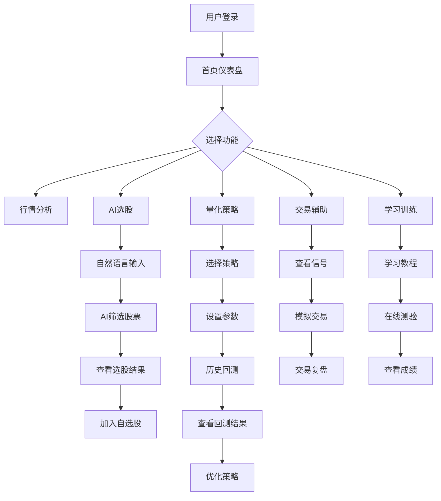

# 个人炒股辅助系统 - 产品需求文档（PRD）

## 1. 产品概述
本系统是一款面向个人投资者的WEB炒股辅助系统，旨在通过AI技术和量化分析，帮助投资者提升决策效率，降低操作门槛。系统覆盖"行情分析→AI选股→量化策略→交易辅助→学习训练"全投资链路，打造一站式智能投资平台。

- **目标用户**：个人投资者、炒股初学者、进阶交易者
- **核心价值**：用AI技术赋能个人投资者，提供机构级的投资分析能力

## 2. 核心功能

### 2.1 用户角色
| 角色 | 注册方式 | 核心权限 |
|------|---------|---------|
| 普通用户 | 邮箱/手机号注册 | 浏览行情、使用AI选股、查看投资报告、学习训练 |
| 高级用户 | 付费升级 | 高级量化策略、回测功能、交易信号提醒、个性化配置 |

### 2.2 功能模块
1. **首页仪表盘**：市场概览、自选股监控、今日热点、AI投资报告入口
2. **行情分析**：实时行情、K线图、技术指标、基本面数据
3. **AI投资报告**：早评/晚评、市场分析、热点解读、投资建议
4. **AI选股策略**：自然语言选股、多因子模型、热点捕手、主题选股
5. **量化交易模型**：策略回测、信号生成、历史验证、参数优化
6. **交易辅助**：买卖信号、仓位管理、风险控制、模拟交易
7. **学习训练**：技术分析教程、模拟交易练习、测验评估

### 2.3 页面详情

| 页面名称 | 模块名称 | 功能描述 |
|---------|---------|---------|
| 首页仪表盘 | 市场概览 | 大盘指数、涨跌家数、资金流向、热门板块 |
| 首页仪表盘 | 自选股监控 | 自选股实时行情、涨跌幅、预警提醒 |
| 首页仪表盘 | AI投资报告 | 每日早评/晚评报告、一键生成投资建议 |
| 行情分析 | K线图表 | 专业K线图、多周期切换、技术指标叠加 |
| 行情分析 | 基本面数据 | 财务报表、估值指标、股东信息 |
| AI选股 | 自然语言选股 | 用自然语言输入选股条件，AI自动筛选 |
| AI选股 | 多因子模型 | 动量、量价、波动率等多维度因子选股 |
| AI选股 | 热点捕手 | 追踪市场热点、题材传导、资金流向 |
| 量化策略 | 策略回测 | 历史数据回测、收益统计、风险指标 |
| 量化策略 | 信号生成 | MA金叉死叉、RSI超买超卖、MACD信号 |
| 交易辅助 | 买卖信号 | 智能买卖点提示、止损止盈建议 |
| 交易辅助 | 仓位管理 | 资金分配、风险控制、仓位上限设置 |
| 学习训练 | 教程中心 | K线基础、技术指标、交易策略教程 |
| 学习训练 | 模拟交易 | 虚拟资金练习、实盘模拟、交易复盘 |

## 3. 核心流程

## 4. 用户界面设计

### 4.1 设计风格
- **主色调**：深邃蓝（#1a365d）配合科技感蓝（#3182ce），体现专业金融属性
- **辅助色**：上涨红（#ef4444）、下跌绿（#22c55e）、中性灰（#64748b）
- **按钮风格**：圆角矩形，hover状态有渐变效果
- **字体**：Inter（现代简洁）配合Roboto Mono（数字显示）
- **布局**：左侧导航+右侧内容区的经典仪表板式布局
- **图标**：Lucide React图标库

### 4.2 页面设计概览

| 页面名称 | 模块名称 | UI元素 |
|---------|---------|--------|
| 首页仪表盘 | 市场概览 | 卡片式布局、实时数据更新、涨跌颜色区分 |
| 首页仪表盘 | 自选股列表 | 表格展示、可排序、点击跳转详情 |
| 行情分析 | K线图表 | 专业图表控件、支持缩放平移、指标叠加 |
| AI选股 | 输入区域 | 大文本框、快捷标签、示例提示 |
| 量化策略 | 回测结果 | 收益曲线、统计指标卡片、参数配置面板 |

### 4.3 响应式设计
- **桌面端**（>1200px）：完整功能展示，多栏布局
- **平板端**（768px-1200px）：简化布局，隐藏次要功能
- **移动端**（<768px）：单列布局，底部导航，核心功能优先

## 5. 非功能需求
- **性能**：页面加载时间<3秒，K线图实时更新<1秒延迟
- **安全性**：数据加密传输，用户隐私保护，防XSS攻击
- **可用性**：99.9%系统可用性，支持7×24小时行情监控
- **扩展性**：模块化设计，支持策略插件化扩展