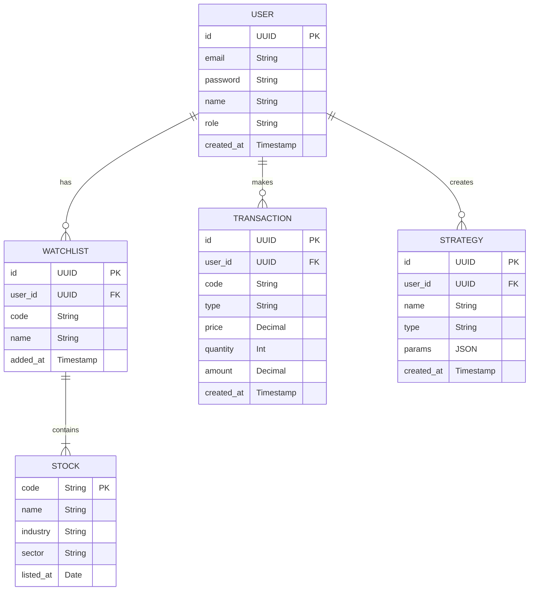
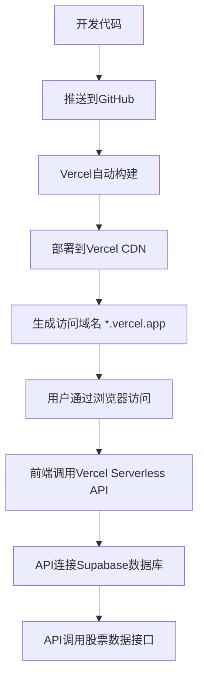

# 个人炒股辅助系统 - 技术架构文档

## 1. 架构设计

```mermaid
flowchart TD
    subgraph 前端层 (Frontend)
        A[React Components] --> B[Pages]
        B --> C[Router]
        C --> D[Store]
        D --> E[API Client]
    end
    
    subgraph 后端层 (Backend)
        F[Express API] --> G[Controllers]
        G --> H[Services]
        H --> I[Data Sources]
        H --> J[AI Service]
        H --> K[Strategy Engine]
    end
    
    subgraph 数据层 (Data)
        L[Supabase DB]
        M[Tushare API]
        N[Free Stock API]
    end
    
    E --> F
    I --> L
    I --> M
    I --> N
```

## 2. 技术选型

| 层级 | 技术 | 版本 | 说明 |
|------|------|------|------|
| 前端框架 | React | 18.x | 主前端框架，组件化开发 |
| 类型系统 | TypeScript | 5.x | 类型安全，提高代码质量 |
| 构建工具 | Vite | 6.x | 快速构建，热更新 |
| 样式框架 | TailwindCSS | 3.x | 原子化CSS，快速开发 |
| 状态管理 | Zustand | 4.x | 轻量级状态管理 |
| 路由 | React Router | 6.x | 单页应用路由 |
| 图表库 | klinecharts | 10.x | 专业K线图表组件 |
| HTTP请求 | Axios | 1.x | HTTP客户端 |
| 后端框架 | Express | 4.x | Node.js后端框架 |
| 数据库 | Supabase | - | PostgreSQL云数据库 |
| AI服务 | OpenAI API | - | 大模型接口 |
| 股票数据 | Tushare + 免费API | - | 行情数据来源 |

## 3. 目录结构

```
stockwin/
├── .trae/documents/          # 产品文档
│   ├── prd.md
│   └── tech_arch.md
├── src/                      # 前端代码
│   ├── components/           # 通用组件
│   │   ├── Layout/           # 布局组件
│   │   ├── Charts/           # 图表组件
│   │   ├── Cards/            # 卡片组件
│   │   └── Forms/            # 表单组件
│   ├── pages/                # 页面组件
│   │   ├── Dashboard/        # 首页仪表盘
│   │   ├── Market/           # 行情分析
│   │   ├── AISelect/         # AI选股
│   │   ├── Strategy/         # 量化策略
│   │   ├── Trading/          # 交易辅助
│   │   └── Learning/         # 学习训练
│   ├── stores/               # Zustand状态管理
│   ├── hooks/                # 自定义Hooks
│   ├── utils/                # 工具函数
│   ├── api/                  # API接口封装
│   └── types/                # TypeScript类型定义
├── api/                      # 后端代码
│   ├── controllers/          # 控制器
│   ├── services/             # 业务逻辑服务
│   ├── middleware/           # 中间件
│   ├── routes/               # 路由定义
│   └── utils/                # 后端工具函数
├── shared/                   # 前后端共享类型
├── .env                      # 环境变量
├── package.json
├── vite.config.ts
├── tailwind.config.js
└── tsconfig.json
```

## 4. 路由定义

| 路由 | 页面 | 功能描述 |
|------|------|---------|
| `/` | Dashboard | 首页仪表盘，市场概览 |
| `/market/:code` | Market | 行情分析，K线图 |
| `/ai-select` | AISelect | AI选股功能 |
| `/strategy` | Strategy | 量化策略回测 |
| `/trading` | Trading | 交易辅助 |
| `/learning` | Learning | 学习训练 |

## 5. API接口定义

### 5.1 股票行情接口

| 接口 | 方法 | 参数 | 返回值 |
|------|------|------|--------|
| `/api/stock/quotes` | GET | `codes`: 股票代码列表 | 实时行情数据 |
| `/api/stock/kline` | GET | `code`, `period`, `startDate`, `endDate` | K线数据 |
| `/api/stock/fundamental` | GET | `code` | 基本面数据 |
| `/api/stock/sectors` | GET | - | 板块数据 |

### 5.2 AI选股接口

| 接口 | 方法 | 参数 | 返回值 |
|------|------|------|--------|
| `/api/ai/select` | POST | `query`: 自然语言查询 | 选股结果 |
| `/api/ai/report` | GET | `type`: morning/evening | AI投资报告 |
| `/api/ai/hotspots` | GET | - | 热点分析 |

### 5.3 量化策略接口

| 接口 | 方法 | 参数 | 返回值 |
|------|------|------|--------|
| `/api/strategy/backtest` | POST | `strategy`, `params`, `code`, `period` | 回测结果 |
| `/api/strategy/signals` | GET | `code`, `indicators` | 技术指标信号 |
| `/api/strategy/list` | GET | - | 策略列表 |

### 5.4 用户接口

| 接口 | 方法 | 参数 | 返回值 |
|------|------|------|--------|
| `/api/user/login` | POST | `email`, `password` | 用户信息 |
| `/api/user/watchlist` | GET | - | 自选股列表 |
| `/api/user/watchlist` | POST | `code` | 添加结果 |
| `/api/user/watchlist/:code` | DELETE | - | 删除结果 |

## 6. 数据模型

### 6.1 ER图



### 6.2 DDL语句

```sql
-- 用户表
CREATE TABLE users (
    id UUID PRIMARY KEY DEFAULT gen_random_uuid(),
    email VARCHAR(255) UNIQUE NOT NULL,
    password VARCHAR(255) NOT NULL,
    name VARCHAR(100),
    role VARCHAR(20) DEFAULT 'user',
    created_at TIMESTAMP DEFAULT CURRENT_TIMESTAMP
);

-- 自选股表
CREATE TABLE watchlist (
    id UUID PRIMARY KEY DEFAULT gen_random_uuid(),
    user_id UUID REFERENCES users(id),
    code VARCHAR(10) NOT NULL,
    name VARCHAR(100),
    added_at TIMESTAMP DEFAULT CURRENT_TIMESTAMP
);

-- 交易记录表
CREATE TABLE transactions (
    id UUID PRIMARY KEY DEFAULT gen_random_uuid(),
    user_id UUID REFERENCES users(id),
    code VARCHAR(10) NOT NULL,
    type VARCHAR(10) NOT NULL,
    price DECIMAL(10, 2) NOT NULL,
    quantity INT NOT NULL,
    amount DECIMAL(12, 2) NOT NULL,
    created_at TIMESTAMP DEFAULT CURRENT_TIMESTAMP
);

-- 策略表
CREATE TABLE strategies (
    id UUID PRIMARY KEY DEFAULT gen_random_uuid(),
    user_id UUID REFERENCES users(id),
    name VARCHAR(100) NOT NULL,
    type VARCHAR(50) NOT NULL,
    params JSONB,
    created_at TIMESTAMP DEFAULT CURRENT_TIMESTAMP
);

-- 股票基础信息表
CREATE TABLE stocks (
    code VARCHAR(10) PRIMARY KEY,
    name VARCHAR(100) NOT NULL,
    industry VARCHAR(100),
    sector VARCHAR(100),
    listed_at DATE
);
```

## 7. 核心技术实现

### 7.1 K线图表实现
- 使用 klinecharts 库渲染专业K线图
- 支持多周期切换（1分钟、5分钟、15分钟、30分钟、60分钟、日线、周线、月线）
- 支持技术指标叠加（MA、MACD、RSI、KDJ、BOLL等）
- 支持缩放、平移、十字光标交互

### 7.2 AI选股实现
- 调用大模型API解析自然语言查询
- 将自然语言转换为量化筛选条件
- 调用股票数据API筛选符合条件的股票
- 返回结构化选股结果和投资建议

### 7.3 量化策略回测
- 使用历史K线数据进行策略回测
- 计算收益率、夏普比率、最大回撤等指标
- 生成收益曲线和交易记录
- 支持参数优化和策略对比

### 7.4 数据同步机制
- 每日盘后自动同步历史数据
- 盘中实时推送行情数据
- 数据缓存优化查询性能
- 支持数据复权处理

## 8. 安全方案

- **用户认证**：JWT令牌认证，密码加密存储
- **数据传输**：HTTPS加密传输
- **API限流**：防止恶意请求
- **输入校验**：前端后端双重校验
- **XSS防护**：HTML转义，内容安全策略
- **CORS配置**：限制跨域访问

## 9. 部署方案

### 9.1 部署平台

| 平台 | 功能 | 免费额度 |
|------|------|---------|
| **Vercel** | 前端托管 + Serverless函数 | 每月100GB带宽、1000小时函数执行时间、`*.vercel.app`免费子域名 |
| **Supabase** | PostgreSQL数据库 + 用户认证 | 500MB数据库存储、1GB文件存储、每月50k MAU |

### 9.2 部署流程



### 9.3 Vercel配置

**vercel.json**
```json
{
  "rewrites": [
    {
      "source": "/api/(.*)",
      "destination": "/api/index.ts"
    },
    {
      "source": "/(.*)",
      "destination": "/"
    }
  ],
  "buildCommand": "npm run build"
}
```

### 9.4 环境变量

| 变量名 | 说明 | 获取方式 |
|--------|------|---------|
| `SUPABASE_URL` | Supabase数据库URL | Supabase控制台 |
| `SUPABASE_ANON_KEY` | Supabase匿名密钥 | Supabase控制台 |
| `OPENAI_API_KEY` | OpenAI API密钥 | OpenAI官网 |
| `TUSHARE_TOKEN` | Tushare数据接口Token | Tushare官网 |

### 9.5 自动同步机制

1. 代码推送到GitHub后，Vercel自动触发构建和部署
2. 部署完成后，新版本立即上线
3. 用户访问时自动获取最新版本（CDN缓存自动刷新）
4. 支持跨设备访问（电脑、平板、手机）